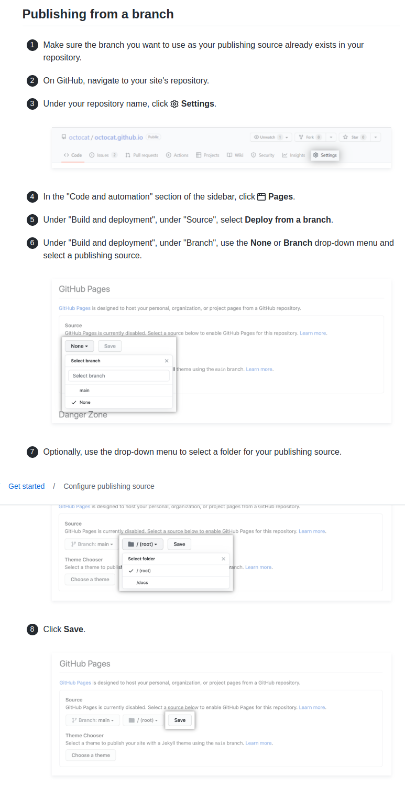

# 图片格式

```markdown
  
  
  
``` 

只支持第一种。

# Hello VuePress

## directory structure

区别于官方推荐的结构: 我们的文档直接放在外面, 并不放在`docs`里面
```bash
.
├── node_modules
├── package.json
├── package-lock.json
└── README.md
```
```bash
.
├── docs
│   ├── .vuepress (可选的)
│   │   └── config.js
│   └── README.md 
├── node_modules
├── package.json
└── package-lock.json
```

## vuepress init(npm version)
```bash
$ cd project

$ npm init

# 将 VuePress 安装为本地依赖
$ npm install -D vuepress

$ vim package.json
"scripts": {
    "vuepress:dev": "vuepress dev",
    "vuepress:build": "vuepress build"
},

$ mkdir .vuepress

$ cd .vuepress

.vuepress$ vim config.js
module.exports = {
    title: 'Hello VuePress',
    description: 'Just playing around',
}

.vuepress$ cd ..

$ npm run docs:dev
```

VuePress 会在 <http://localhost:8080> (opens new window)启动一个热重载的开发服务器。

## vuepress init(yarn version)

因为npm会出错（比如win上失败了），而yarn则成功了

```bash
$ cd project

$ yarn init

# 将 VuePress 安装为本地依赖
$ yarn add vuepress -dev

$ vim package.json
"scripts": {
    "vuepress:dev": "vuepress dev",
    "vuepress:build": "vuepress build"
},

$ mkdir .vuepress

$ cd .vuepress

.vuepress$ vim config.js
module.exports = {
    title: 'Hello VuePress',
    description: 'Just playing around',
}

.vuepress$ cd ..

$ yarn vuepress:dev
```
# GitPages

如果懒的话, 不用vuepress, gitpages也可以直接显示md文档


Publishing from a branch: 手动提交到gh-pages
Publishing with a custom GitHub Actions workflow: 提交到主分支时就会自动更新
## Publishing from a branch


- 自动Publish的分支是`gh-pages`, 其他命名的分支你还得手动去在setting里选.
- 还可以选择`/`或者`/docs`为source(这估计就是为什么vuepresss推荐的官方格式)

<!--    -->

一个自动编译,然后提交到gh-pages分支的脚本
```bash
#!/usr/bin/env sh

# 确保脚本抛出遇到的错误
set -e

# 生成静态文件
npm run docs:build

# 进入生成的文件夹
cd ./.vuepress/dist

git init
git add -A
git commit -m 'deploy'

# 如果发布到 https://<USERNAME>.github.io
# git push -f git@github.com:<USERNAME>/<USERNAME>.github.io.git master

# 如果发布到 https://<USERNAME>.github.io/<REPO>
# git push -f git@github.com:<USERNAME>/<REPO>.git master:gh-pages

# 把上面的 <USERNAME> 换成你自己的 Github 用户名，<REPO> 换成仓库名，比如我这里就是：
git push -f git@github.com:sword4869/vuepress.git master:gh-pages

cd -
```
## Publishing with a custom GitHub Actions workflow

```bash
$ mkdir -p .github/workflows

$ cd .github/workflows

# 名字随便
.github/workflows$ vim actions.yml
```
创建token
点击你的头像 > Settings > Developer settings > Personal access tokens > Generate new token (classic). 权限至少要勾选repo, workflow

在仓库Settings> Secrets> Actions> New repository secret> 命名变量`ACCESS_TOKEN`, 填上生成token的值
```yaml
name: Build and Deploy
on: [push]
jobs:
  build-and-deploy:
    runs-on: ubuntu-latest
    steps:
    - name: Checkout
      uses: actions/checkout@master

    - name: vuepress-deploy
      uses: jenkey2011/vuepress-deploy@master
      env:
        ACCESS_TOKEN: ${{ secrets.ACCESS_TOKEN }}
        # 默认当前仓库
        # TARGET_REPO: username/repo
        # 默认 gh-pages
        # TARGET_BRANCH: master
        BUILD_SCRIPT: npm install && npm run docs:build
        BUILD_DIR: ./.vuepress/dist/
```
`TARGET_BRANCH`: 这个不是根据哪个分支什么, 而是是要生成的. 所以你会看到自己多了一个gh-pages分支