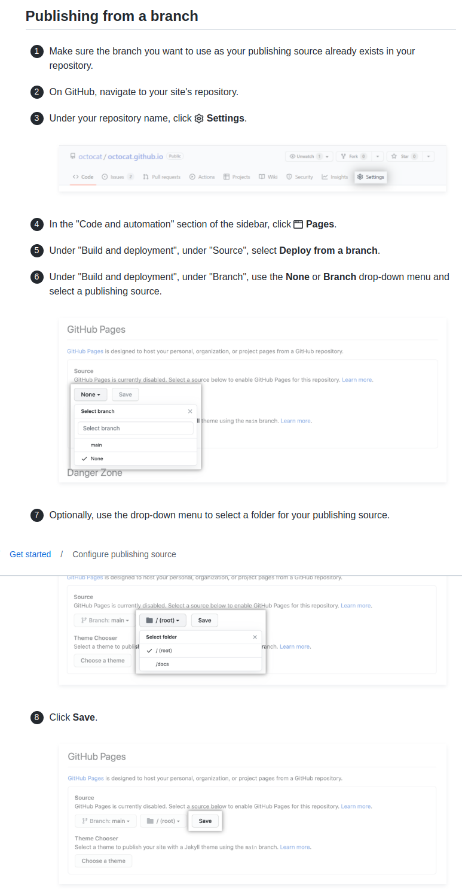

# 推送项目到GitPages

如果懒的话, 不用vuepress, gitpages也可以直接显示md文档

手动提交到gh-pages

- 自动Publish的分支是`gh-pages`, 其他命名的分支你还得手动去在setting里选.

- 还可以选择`/`或者`/docs`为source(这估计就是为什么vuepresss推荐的文档放在docs文件夹中)

[一个自动编译,然后提交到gh-pages分支的脚本](../../deploy.sh)