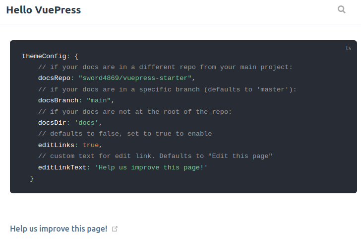
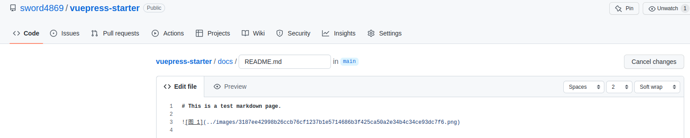

# theme

## github edit
```ts
themeConfig: {
    // if your docs are in a different repo from your main project:
    docsRepo: "sword4869/vuepress-starter",
    // if your docs are in a specific branch (defaults to 'master'):
    docsBranch: "main",
    // if your docs are not at the root of the repo:
    docsDir: 'docs',
    // defaults to false, set to true to enable
    editLinks: true,
    // custom text for edit link. Defaults to "Edit this page"
    editLinkText: 'Help us improve this page!'
}
```
效果:


 
  

## sidebar

```ts
themeConfig: {
    sidebar: [
      {
        title: 'create',
        children: [
          '/create/deploy脚本.md',
          '/create/github action.md',
          '/create/图片格式.md',
          '/create/空项目.md',
        ],
      },
      {
        title: 'theme',
        children: [
          '/theme.md',
        ]
      }
    ]
}
```